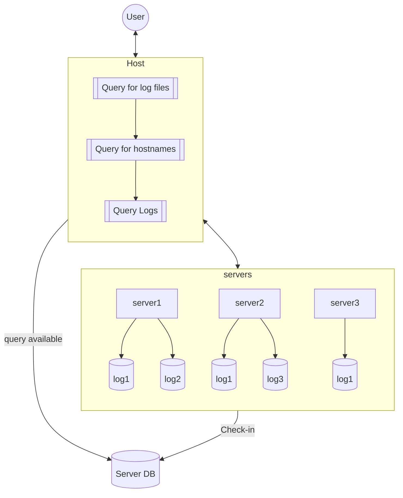
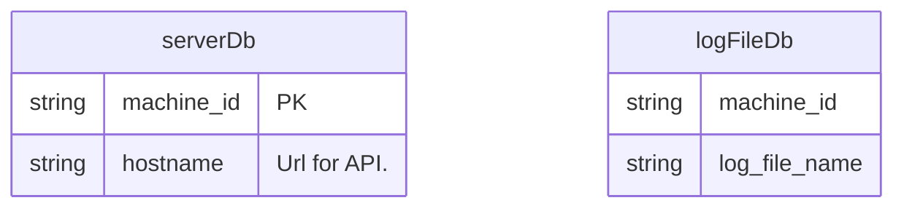

# Bonus
Add the ability to issue a REST request to one “primary” server which subsequently requests those logs from a list of “secondary” servers There aren’t any hard requirements for the protocol used between the primary and secondary servers, and the architecture is completely up to you.

## System
Rough system design.




Envisioned basic API structure:
```http
# Return a list of all available machines on network.
GET http://{HOSTNAME}/api/v1/machines

# Return a list of all log files available on a given machine
GET http://{HOSTNAME}/api/v1/machines/:id/logs/

# Return logs for given file on a given machine
GET http://{HOSTNAME}/api/v1/machines/:id/logs/:filename?entires={ENTRIES}&filter={filter}
```
