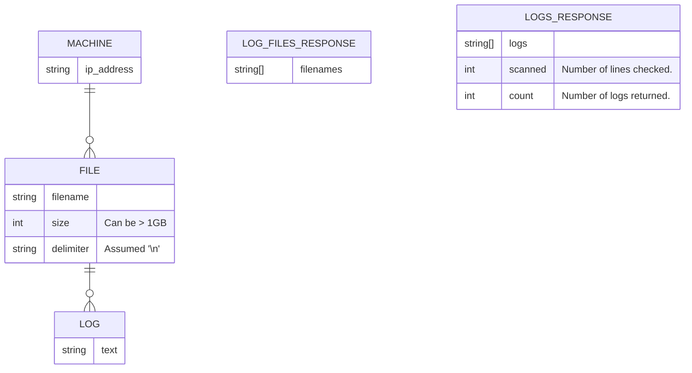

# Design
The logic for log retrieval is structured around a `/logs/:filename` endpoint that retrieves the logs for a given filename. This implementation was a fairly straightforward Express server with two routes, one for retrieving available files, and one for retrieving the logs for a given file. In addition to those routes validations are implemented to give some basic checks on incoming filenames and queries for entries and filter.

Outside of core API routing the primary hurdle was implementing log read lookup using the node `fs` lib for large files. This lib has a standard function for reading small files in memory, however it does not handle large files well and can can cause memory issues. 

In order to work around that limitation I implemented a batch read strategy using `fs` read streams so I could read a reasonably sized chunk of data at a time, starting at the chunk at the end of the file. This allows me to read through very large files in a reasonable time and filter subsets of that data while reading.

## Entities
Core entities involved in the system.

## Limitations & Improvements
### Log Formatting
Logs were assumed to end with `\n`. If logs follow a different format or multiple formats are needed changes will be required.
### Sizes
Since there were some unknowns going in assumptions had to be made. I assumed responding with the full contents of a query was acceptable for basic implementation, however this is likely not best practice. Typically REST API payloads are capped around 2-10 MB to avoid data loss. To work around this many times large GETs are broken into successive requests with a token provided to query for the next batch.Long lived streams may also help to break the data up into chunks for easier handling by the recipient.

I also added a limit to max file size of 10 GB to prevent any runaway processes.

These max sizes are all editable in the `/backend/src/conf.js` config file.

### Parallelization
In order to further improve read times for large files parallelization could be utilized to break up each individual stream read into a thread run in parallel. This would improve read times by the number of threads run.

### Testing
Due to time constraints I did not implement a full unit test suite, however that would be required prior to any production release. The tests included are more akin to integration tests than isolated unit tests.

### Typing
Adding Typescript for stricter typing may be desired for some teams.

### Auth
For production authentication may be required to request logs depending on how the network is configured.

### Logging
Team standards may require logging formats / frameworks to be utilized in the service.

### Documentation
Swagger documentation would be preferred prior to prod release.

### CI
CI processes would be required prior to production release including automated testing, integration testing, linting, and others.

## Clarifying Questions
1. Is a filename required?
   1. If not what is the default log file location / name?
2. Limits:
   1. Max file size allowed?
   2. Max line/log size allowed?
3. Are multiple responses allowed for large payloads?
4. Is it safe to assume log entries are delimited by a newline char `\n`? 
5. Testing frameworks allowed?
   1. Unit tests desired?
